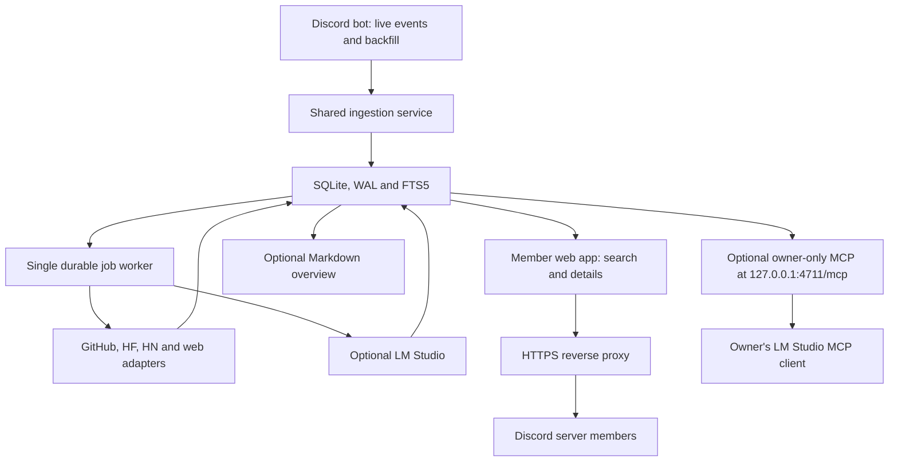

# Discord Intel — Implementation Plan and LLM Handoff

**Document date:** 2026-09-27  
**Target environment:** Windows 11, Python, `uv`, SQLite, a Discord bot, a small web app, and optional local LM Studio  
**Project name used below:** `discord-intel`

## Implementation progress

- [x] Milestone 0 — account and permissions setup documented in `README.md`.
- [x] Milestone 1 — scaffold and specification complete.
- [x] Milestone 2 — SQLite and append-only migrations complete.
- [x] Milestone 3 — URL extraction and canonicalization complete.
- [x] Milestone 4 — live Discord ingestion complete.
- [x] Milestone 5 — backfill, edits, and deletions complete.
- [x] Milestone 6 — durable enrichment worker complete.
- [x] Milestone 6A — configurable cross-channel topic categories complete.
- [ ] Milestone 9 — next: keyword/topic search over stored URLs and Discord text.

> **MVP scope revision (2026-09-27):** The user prioritizes one searchable library for
> friends with topic categories spanning channels. The current sequence is 6A, 9, 10A.
> Provider integrations (7-8C), advanced filters, and optional owner/AI features (10B-16)
> are deferred beyond this MVP. The original briefs below remain future reference, not
> prerequisites for releasing member search. No GitHub runners or agents are part of the app.

> **For the coding assistant:** This is a build specification, not a request to implement every milestone in one pass. Start at the first incomplete milestone in `PLAN.md`, finish and validate it, update the project documents, and stop. Verify the current official documentation before writing any integration code. This document is self-contained; do not assume access to the conversation that produced it.

## 1. Goal

Build a searchable website for members of one Discord server, backed by a local index of interesting URLs shared in specifically allowed channels. Preserve nearby discussion so members can discover what was shared, who mentioned it, and why it mattered. Enrich links from GitHub, Hugging Face, Hacker News, and ordinary web pages. Use SQLite FTS5 for fast search. An optional local MCP endpoint lets the owner query the archive from LM Studio; optional local summaries and embeddings come later.

**The first useful release is complete after Milestone 10A:** authorized server members can log in, search and filter approved shared links, inspect a link and its bounded Discord context, and open the original Discord message. Collection, enrichment and search work without LM Studio. The Markdown overview (Milestone 10B) and owner-only MCP interface (Milestone 11) remain useful optional outputs.

### Invariants

1. Use an authorized Discord **bot**, never a user token or self-bot. Ingest only configured guild/channel IDs. Enable the privileged message-content intent in the developer portal and code as required.
2. Save every message in an allowed channel, including messages without URLs, because nearby discussion gives links their meaning. Do not index channels outside the allowlist. Web visibility is a *separate explicit allowlist* of source channels intended for every member of the server; it defaults to empty.
3. A canonical link is one global record; each appearance in a message is an individual occurrence. Two messages sharing one canonical URL produce one `links` row and two `message_links` rows. Two appearances in the *same* message also produce two occurrences.
4. Message ingestion is idempotent by Discord message ID. Edits reconcile occurrences; deletes are soft deletes. Enrichment failures never remove original messages or links.
5. Discord event callbacks perform local parsing and transactional persistence only. Network fetching, GitHub/HF calls, and LLM calls run in durable background jobs.
6. Deterministic collection, metadata, FTS and the member website continue to work while LM Studio is offline. Do not make semantic retrieval or generated summaries a prerequisite for finding links.
7. The website requires Discord OAuth2 login and current membership in the configured guild. Search, detail, context and JSON endpoints all enforce the same authorization and web-visible source filter. Never expose a private-channel mention through a title, snippet, source count, surrounding message or search rank.
8. Bind the Python web server to `127.0.0.1` behind an HTTPS reverse proxy or authenticated tunnel for remote users. Keep owner MCP bound to loopback and do not proxy it publicly. Treat posted URLs as untrusted when fetching them. Keep tokens out of source control and logs.
9. Persist original URL text and canonical URL separately. Never remove a meaningful query parameter merely to improve deduplication.

## 2. System shape



Initially run two Windows processes: `discord-intel run` hosts the Discord collector, one worker, and refresh scheduling; `discord-intel web` serves the member website on loopback. Add `discord-intel mcp` as an optional third, owner-only process in Milestone 11. An HTTPS reverse proxy or tunnel exposes *only* the web app to remote members. SQLite uses WAL so these processes can coexist. Use server-rendered HTML with Jinja2 and a small amount of JavaScript if needed. Do not introduce Docker, Redis, Celery, an ORM, a vector database, or a single-page application for v1.

## 3. Repository and working agreement

Create a `src/discord_intel/` Python package, `tests/`, `docs/`, `migrations/`, a `pyproject.toml`, `.env.example`, `.gitignore`, and these persistent project documents:

| File | Purpose |
|---|---|
| `AGENTS.md` | Short rules for coding assistants: milestone scope, source verification, validation, documentation updates. |
| `SPEC.md` | Product behavior, full schema, identity and status rules, invariants and acceptance criteria. |
| `PLAN.md` | Ordered milestones 0–16 with one status per milestone and the current milestone clearly marked. |
| `IMPLEMENT.md` | Component boundaries, data flow, CLI entry points and choices needed to implement the current milestone. |
| `DOCUMENTATION.md` | User instructions: setup, permissions, configuration, run modes, commands, troubleshooting. |
| `DECISIONS.md` | Dated architectural decisions, changes from this plan, and API contract discrepancies. |
| `docs/API_CONTRACTS.md` | Versioned links to current official API documentation and exact behavior used by each adapter. |

Use Python 3.12 or newer on the target machine unless a dependency forces an adjustment. Use `uv` for dependencies and commands, `ruff`, `mypy`, `pytest`, `pytest-asyncio`, and `respx` where appropriate. Prefer `discord.py`, `aiosqlite`, `httpx`, `trafilatura`, `huggingface_hub`, `pydantic`, and, at Milestone 10A, FastAPI/Starlette with Jinja2 for a small server-rendered site. Add the official `mcp` Python SDK v2 at Milestone 11, `openai` at Milestone 12 and `numpy` at Milestone 13. Pin tested dependency ranges in the project, rather than assuming that a future release keeps the same imports.

Each milestone gets a focused commit after validation. Do not silently refactor unrelated working features. Unit and mocked-provider tests must run offline. Live integration tests, if any, require an explicit `integration` marker and are excluded from the normal test run.

### Reusable coding-assistant prompt

Paste this before the *specific* milestone brief in section 6:

```text
Read AGENTS.md, SPEC.md, PLAN.md, IMPLEMENT.md, DOCUMENTATION.md, DECISIONS.md, and docs/API_CONTRACTS.md before making changes. If this is the initial scaffold milestone, create those files from the supplied Discord Intel implementation plan first.

Work only on the first incomplete milestone in PLAN.md. Before implementing any external API behavior, verify its current official documentation and update docs/API_CONTRACTS.md. If the documentation differs from this plan, record the discrepancy in DECISIONS.md and implement against the verified current contract.

Do not expand scope or refactor unrelated working code. Add meaningful tests for behavior changed in this milestone. Run `uv run ruff check .`, `uv run mypy src`, and `uv run pytest -q`; fix failures before declaring the milestone complete. Update PLAN.md and DOCUMENTATION.md, and record architectural decisions in DECISIONS.md. Report the changed files, test results, and known limits. Do not start the next milestone.
```

## 4. Configuration, privacy, and identity

Configuration through validated environment variables or a local config file: Discord bot token; one target guild ID; allowed source channel IDs; a separate list of web-visible channel IDs (empty by default); Discord OAuth client ID/secret and exact HTTPS redirect URI; web session secret; database path; optional GitHub and HF tokens; optional LM Studio base URL and models; worker retries; refresh and backup settings; web bind host/port; optional MCP bind host/port. The web server binds to `127.0.0.1:4710` behind HTTPS; MCP binds to `127.0.0.1:4711` and is never put on the public proxy. The default LM Studio base URL is `http://127.0.0.1:1234/v1`. Store example keys with placeholders only. Parse Discord snowflakes as decimal strings or lossless integers; never use JavaScript-style floating point representations for identity. Store timestamps as UTC ISO-8601 strings with a documented consistent format.

No token value, OAuth authorization code, session cookie, authorization header, raw secret-bearing query value, or private model-card text belongs in logs. Store message content locally only for allowlisted channels. Provide a documented way to stop ingestion and remove local data if the channel owner requests it. Avoid replaying deleted messages as current content in search or web/MCP responses; keep deletion markers for audit and the explicit retention policy.

### Web access model

For v1, serve one guild. A user signs in with Discord's authorization-code OAuth2 flow with the **`identify`** scope. Use `state` tied to a short-lived login attempt; exchange the code server-side and call `/users/@me` to obtain the user ID. The bot checks that exact ID via Discord's `Get Guild Member` endpoint for the configured guild. Do not infer membership merely because the user authenticated with Discord; do not request broad guild-list or member-list scopes when a per-member check works. Keep no long-lived user OAuth token: establish an opaque, random, expiring server-side session with a Secure, HttpOnly, SameSite cookie. Recheck membership at least every five minutes, including for already logged-in users; after the cache expires, fail closed if Discord cannot be reached. Logout invalidates the session. Do not allow user-supplied redirects after login.

Only indexed channels explicitly marked **web-visible** may appear on the member site. For this first version, configure such channels only when the server owner designates them as readable by all server members. Validate that the channel is in the ingestion allowlist and has no restrictive channel/category permission overrides that could hide it from a member; if its visibility becomes uncertain, remove it from web results until an administrator resolves it. Generalizing to private channels would require correct per-viewer Discord permission evaluation and is out of scope for v1. A member can see only the web-visible source occurrence, its author, and bounded context from that same web-visible channel. No admin-only links, cross-channel excerpts, private notes, owner lifecycle state/manual tags, internal summaries or database internals should reach the member interface.

Keep both `GET` and any future write endpoints authenticated. Set no-store cache headers on authenticated responses; escape untrusted Discord/provider text in HTML, make external links safe, cap query size and results, and apply a small per-session/IP request rate limit. Protect any state-changing forms with CSRF tokens. Terminate TLS at a reverse proxy or a tunnel; expose only the web service to it, never the bot, SQLite file, local LM Studio or MCP. Deployment recipe: choose an HTTPS hostname or tunnel address; set the public base URL; register that exact address plus `/auth/callback` with Discord; route the HTTPS hostname only to loopback port 4710; verify callback, `Secure` cookies and proxy-forwarded scheme/host handling; test externally that ports 4711 (MCP) and 1234 (LM Studio) are unreachable. Keep an optional LAN-only development mode clearly separate from the remote-member configuration.

## 5. Baseline SQLite schema

Make the following the normative schema in `SPEC.md` during Milestone 1; implement it with append-only SQL migrations in Milestone 2. Column names may be refined while scaffolding, but preserve the identities, relationships and behaviors described here. Subsequent milestones add their stated tables or columns through new migrations. Migration records become immutable after release.

| Table | Key fields and constraints | Purpose |
|---|---|---|
| `schema_migrations` | `version` PK, `filename`, checksum, `applied_at` | Track ordered SQL files, reject modified applied migrations. |
| `guilds` | Discord `guild_id` unique, name, timestamps | Only allowed guilds. |
| `channels` | Discord `channel_id` unique; FK `guild_id`; name, kind; `web_visible` default false | Only allowed channels; web visibility is explicit and separately validated. |
| `authors` | Discord `author_id` unique; display name, username, bot flag | Message authors; update renamed display names. |
| `messages` | Discord `message_id` unique; FK channel/author; `content`, Discord `created_at`, `edited_at`, `deleted_at`, `has_links`, `ingested_at` | Archive allowlisted conversation. Edited content replaces current content; deleted messages are hidden from current search/context. |
| `links` | local `link_id` PK; `canonical_url` unique; original first URL, host/domain, provider, resource type, title, description, `first_seen`, `last_seen`, metadata timestamps, enrichment state | One record for each canonical URL. Deleting an occurrence does not delete a link. |
| `message_links` | PK; FK message/link; `occurrence_index`, `raw_url`, `start_offset`, `end_offset`, `created_at`; unique `(message_id, occurrence_index)` | Every URL occurrence, including repetitions inside one message. Offsets refer to the stored message content. |
| `link_metadata` | PK/FK link, provider, structured JSON, readable text, ETag, Last-Modified, fetched/checked times, content hash | Provider facts and limited searchable body; never overwrite manual user fields. If different endpoints need independent conditional cache state, add endpoint-scoped child rows. |
| `jobs` | `job_id` PK; FK link where applicable; `kind`, status, `available_at`, `attempt_count`, `started_at`, `finished_at`, `last_error`, deduplication key | Durable enrichment/rebuild/summarize work. Prevent duplicate outstanding work for same link and kind. |
| `channel_checkpoints` | channel FK unique; last safely committed Discord message ID, update time, backfill state | Resume oldest-to-newest history after crash. Update atomically with the processed batch. |
| `tags` and `link_tags` | tag unique; link/tag/source unique; source = manual/provider/LLM | Preserve tag provenance and manual edits through refresh. |
| `link_state` and `link_notes` | one state row per link; append-only note records | Status, next action, blocked-by and human notes added in Milestone 14. |
| `link_summaries` | FK link; model ID, prompt version, source content hash, structured JSON, generated time | Versioned optional summaries added in Milestone 12. |
| `link_embeddings` | FK link; model ID, dimension, float32 BLOB, content hash, generated time; unique `(link_id, model)` | Optional local vectors added in Milestone 13. |
| `search_documents` / `search_fts` | one document per link with title, description, tags, body, Discord context; FTS5 index keyed to its row ID | Rebuild link-centric search from current facts and non-deleted occurrences. |
| `web_search_documents` / `web_search_fts` | one document per link with at least one live web-visible occurrence; searchable text excludes private message/context fields | Separate, member-safe FTS surface. Scope before ranking and snippets, not after unscoped search. |
| `web_sessions` | hashed opaque session ID PK, Discord user ID, created/expires, last verified membership time | Short-lived server-side web sessions added at Milestone 10A. No long-lived user OAuth token stored. |

Choose either external-content FTS5 with synchronized triggers or a service that transactionally updates both tables; document the consistency rule and test it. Build web FTS documents only from external/provider metadata, provider-derived public tags and non-deleted mentions in web-visible channels. Shared link rows may also have private occurrences: the member site must calculate first/last seen, authors, count and snippets strictly from visible occurrences and must never expose private-only links or owner-only status, manual tags, notes and summaries. Rebuild both FTS surfaces when source visibility, message edits/deletes, occurrences or metadata change. Indices should cover `(channel_id, created_at, message_id)` for context, `(link_id, message_id)` for occurrences, job availability, and source filters. SQLite connection setup: `PRAGMA foreign_keys=ON`, `journal_mode=WAL`, `synchronous=NORMAL`, and a nonzero `busy_timeout`. Explicit transaction boundaries must keep an ingest, its occurrences, job enqueue, and checkpoint updates coherent.

Canonical link identity is URL-based, so a GitHub repository homepage and one of its issue pages are *different* links. A derived `provider_repo` such as `hyperlogue/r3` can associate them for display without collapsing them. If canonicalization rules change, create a documented migration/reconciliation procedure; never silently re-key stored URLs.

### Status enum

Start with `NEW`, `TRY`, `WATCH`, `TESTING`, `DONE`, `BLOCKED`, and `ARCHIVED`. `NEW` is the default. Record these values in `SPEC.md` and validate all status changes. A status belongs to a link, not an occurrence. Manual tags and notes survive provider refreshes and LLM reruns.

## 6. Milestone briefs and acceptance criteria

### Milestone 0 — Accounts and permissions

**Deliverables:** Instructions for creating a Discord application and bot, installing it only in the chosen guild, granting `VIEW_CHANNEL` and `READ_MESSAGE_HISTORY` to allowed channels, enabling Message Content Intent, obtaining the chosen channel IDs, configuring OAuth2 `identify` and an exact HTTPS callback URI, and storing credentials locally. Decide which ingested channels are intentionally visible to all guild members; leave the web-visible list empty until designated. Distinguish bot token, OAuth client secret and session secret (required) from GitHub and HF tokens (optional for public content). Do not ask for credentials in source code or commits.

**Acceptance:** The user can identify the bot, guild, indexed channel IDs and web-visible channel IDs, register the OAuth callback, and set secrets without exposing them. This step may require Discord administrator access and a public HTTPS hostname for remote members.

**Assistant brief:** `Complete Milestone 0 only. Document authorized Discord bot creation, permissions, message-content intent, ingestion and web-visibility allowlists, Discord OAuth identify callback, HTTPS hostname and safe secrets. Never use a user account token. Do not proceed to implementation milestones.`

### Milestone 1 — Scaffold and freeze the specification

**Deliverables:** Python package, CLI skeleton with `--help`, `pyproject.toml`, tests skeleton, `.env.example`, ignored local state and secrets, all persistent documents in section 3. Put the table/identity/access rules in `SPEC.md`, dependencies and statuses in `PLAN.md`, and verified documentation links in `docs/API_CONTRACTS.md`. Choose a clear package layout such as `db/`, `ingest/`, `urls/`, `providers/`, `jobs/`, `search/`, `web/`, optional `mcp/`, and `cli.py`.

**Acceptance:** The project installs, its CLI help works, and lint/type/test gates pass with a minimal smoke test.

**Assistant brief:** `Implement Milestone 1 only: scaffold discord-intel as a Python package managed by uv. Create AGENTS.md, SPEC.md, PLAN.md, IMPLEMENT.md, DOCUMENTATION.md, DECISIONS.md, and docs/API_CONTRACTS.md from this plan. Add validated settings, a CLI skeleton and offline validation setup. No Discord connection or provider requests yet.`

### Milestone 2 — SQLite and append-only migrations

**Deliverables:** `aiosqlite`, ordered `.sql` migrations, migration tracking and checksum checking; normalized core tables, FTS5 tables, constraints and repository methods for guilds, channels, authors, messages, links and individual occurrences. `db init` is idempotent. Make repeated upserts preserve original first-seen values while updating last-seen fields appropriately.

**Acceptance:** Insert the same canonical URL in two messages and get exactly `links=1`, `messages=2`, `message_links=2`. Repeating initialization changes nothing; foreign keys reject invalid references; two occurrences in one message can coexist. Test migration reruns and checksum mismatch.

**Assistant brief:** `Implement Milestone 2 only: aiosqlite persistence and append-only SQL migrations. Enable foreign_keys, WAL, synchronous=NORMAL and busy_timeout. Implement all normalized core tables and FTS5 schema specified in SPEC.md, migration tracking, idempotent db init and repository upserts. Test deduplication, multiple occurrences, migration idempotence and foreign-key behavior. No ORM or Alembic.`

### Milestone 3 — URL extraction and canonicalization

**Deliverables:** Extract multiple HTTP(S) URLs from message text with exact original spans and safe removal of surrounding punctuation. Generic normalization lowercases scheme/host, removes default ports and fragments, normalizes root trailing slash, and removes only known tracking keys (`utm_*`, `fbclid`, `gclid`). Provider normalizers: GitHub hostname/owner/repo and deep paths; HF model/dataset/Space path identity; Hacker News `item?id=N`. Preserve meaningful query strings (e.g. HN `id`). Validate malformed inputs, IDNs, percent encoding and uncommon but valid URLs without broad destructive rewrites.

**Acceptance:** At least 30 table-driven cases. `github.com/owner/repo`, its trailing-slash form, and `www.github.com/owner/repo` dedupe; `/issues/12` remains distinct. The raw URL and occurrence offset remain accurate. `item?id=12345` retains its ID.

**Assistant brief:** `Implement Milestone 3 only: extract every HTTP(S) URL and canonicalize with conservative generic rules plus GitHub, Hugging Face and Hacker News provider rules. Preserve raw URLs and meaningful query parameters. Derive GitHub owner/repo without collapsing deep links. Add at least 30 table-driven cases covering punctuation, duplicates, fragments, tracking, HN IDs and meaningful queries.`

### Milestone 4 — Live Discord ingestion

**Deliverables:** `discord.py` bot configured with only guilds, messages, message_content intents needed for this feature. Allowlist guilds and channels, ignore this bot's own messages, persist all allowed messages, parse and associate HTTP(S) URLs, enqueue new or stale enrichment jobs transactionally. Use a shared ingestion service callable without Discord. Keep handlers quick and do not call external providers or a model inside callbacks.

**Acceptance:** A new GitHub URL creates one message, one link, one occurrence and one pending job. Posting it in another message leaves one link and adds another occurrence. Replayed event creates no duplicates. Non-link allowed messages are saved. Outside channels are ignored. Unit tests use fabricated message fixtures and never connect to Discord.

**Assistant brief:** `Implement Milestone 4 only: live Discord collection via discord.py. Allowlist exact configured guild/channel IDs, archive every allowed message, ignore this bot, create links/jobs only for supported HTTP(S) URLs, and keep network/LLM work out of event handlers. Make ingestion idempotent by Discord message ID and add offline fixture tests.`

### Milestone 5 — Backfill, edits, and deletions

**Deliverables:** `discord-intel backfill --channel-id ID` uses `discord.py` channel history, oldest-to-newest, and the *same* ingestion service. Persist per-channel checkpoints in the same transaction as processed messages and periodically commit; resume with no duplicates. On raw edit, fetch current message if needed, update content and reconcile the ordered occurrences (including repeated URLs). On raw delete, set `deleted_at` and remove the message from current searchable discussion; retain global links and audit state.

**Acceptance:** Interrupt a several-hundred-message import, restart, and observe complete ingestion without duplicate IDs. An edit from repo A to repo B removes the A association and adds B. An edit removing one of two identical URLs leaves one occurrence. Deleting a message marks it deleted and leaves its link record intact. Tests are offline.

**Assistant brief:** `Implement Milestone 5 only: restart-safe Discord backfill with channel history and atomic per-channel checkpoints, plus raw edits and soft deletes. Reuse the live ingestion service; reconcile occurrences on edit. Test restart, repeated URLs, changed URLs and deletion.`

### Milestone 6 — Durable enrichment worker

**Deliverables:** One SQLite-backed worker and provider adapter protocol/registry selected from canonical URL/resource type. Claim pending jobs due at `available_at`, mark running, increment attempts, and set `started_at`. Success marks succeeded and enqueues search-document rebuild; transient failure returns to pending after bounded exponential backoff such as 30 seconds, 2 minutes, 10 minutes, 1 hour, 6 hours; permanent failure marks failed. Reset stale running jobs older than 15 minutes at startup. Make job claims atomic, prevent duplicate outstanding jobs and keep source links intact on failures.

**Acceptance:** Fake adapters demonstrate success, retry, failure threshold, crash recovery, idempotent enqueue and search-rebuild scheduling. One worker is enough; no external queue service.

**Assistant brief:** `Implement Milestone 6 only: durable jobs, a single worker, atomic claims, retry/backoff, stale-running recovery and a provider registry. Provider failures cannot modify Discord ingestion or delete links. Test with fake adapters, including successful search-rebuild scheduling. No Redis/Celery/RQ.`

### Milestone 6A — Cross-channel topic categories (complete)

**Deliverables:** Configurable literal keyword rules against canonical URLs and current
Discord message prose. Default topics: Coding, Image Generation, Models, Tutorials, Tools.
Allow multiple topics per link; use Uncategorized only when nothing matches. Read-time
classification covers existing data and reflects edits/deletes without a migration or AI.
Provide an owner-local category preview and an independently scoped member query service.

**Acceptance:** Offline tests cover overlapping topics, word boundaries, custom rules,
repeated occurrences, cross-channel evidence, edits/deletes, visibility revocation,
private/public overlap, bounded results, and the local command.

### Milestone 7 — GitHub metadata (deferred beyond MVP)

**Deliverables:** Verify and document official REST contract before coding. Call `api.github.com` with `Accept: application/vnd.github+json`, a real `User-Agent`, and `X-GitHub-Api-Version: 2026-03-10`; add `Authorization: Bearer ...` only when a token is configured. For repository URLs retrieve `/repos/{owner}/{repo}`, `/topics`, `/readme` sequentially; store full name, description, homepage, language, stars, forks, open issues, archived/fork/visibility/license, dates, default branch, topics and decoded README. Cache ETag and Last-Modified *per endpoint* and issue conditional refreshes; treat 304 as success without erasing previous content. Respect Retry-After and rate-limit reset. Deep GitHub URLs retain distinct identity and may reuse repository metadata without pretending the issue is the repository homepage.

**Acceptance:** `respx` covers 200, 304, 404, rate-limited 403/429, malformed repository paths, conditional headers, and public access without a token. No live calls in unit tests.

**Assistant brief:** `Implement Milestone 7 only: GitHub REST repository metadata, topics and README at version 2026-03-10. Update API_CONTRACTS.md first. Use conditional endpoint-specific caching, optional Bearer token, rate-limit handling and sequential calls. Do not scrape HTML. Add mocked request/response tests.`

### Milestone 8A — Hugging Face models

**Deliverables:** Parse HF model URLs to repository IDs. Use documented `HfApi.model_info()` and `ModelCard.load()` from `huggingface_hub` for model information and card text. Store model ID, author, pipeline, library, tags, downloads, likes, last modification, SHA, gated/private state, card metadata/text. Optional token supports entitled gated/private access; public models work without it. Distinguish `/datasets/` and `/spaces/` URL types even if this increment enriches models only; route unsupported types to an explicitly defined fallback.

**Acceptance:** Mocked public, gated, inaccessible and missing repository responses preserve link records and surface appropriate job state.

**Assistant brief:** `Implement Milestone 8A only: Hugging Face model URL parsing and enrichment through official huggingface_hub HfApi.model_info and ModelCard.load, with optional token and public access. Store bounded model metadata/card text; mock success and access failures. Never scrape Hub HTML for data exposed by the library.`

### Milestone 8B — Hacker News

**Deliverables:** Parse numeric `news.ycombinator.com/item?id=N`; fetch `https://hacker-news.firebaseio.com/v0/item/N.json`. Store documented item ID/type/title/by/time/url/score/descendants/text. Convert item HTML text to safe plain text before indexing. Do not recursively fetch comment trees.

**Acceptance:** Mock story, comment, deleted/dead item, missing or invalid ID, 404/null result and HTTP failure. Preserve source link even when enrichment fails.

**Assistant brief:** `Implement Milestone 8B only: official HN Firebase v0 item API enrichment for item?id=N. Do not crawl comments. Convert HTML text to safe plain text. Add mocked story, comment, dead/deleted, missing-ID and HTTP-failure tests.`

### Milestone 8C — Generic web pages and SSRF protection

**Deliverables:** A shared `httpx.AsyncClient` for URLs without a provider adapter. Permit only HTTP(S); reject loopback, private, link-local, multicast and reserved IP destinations for both literal IPs and resolved names. Validate *every redirect target*; prevent DNS rebinding by connecting to an address that was validated (or an equivalent transport-level enforcement), while retaining the correct Host/SNI, and document the strategy. Do not rely on a separate DNS check followed by unconstrained resolver use. Set connect timeout 5 seconds, read timeout 15 seconds, at most five redirects, max body 4 MiB, bounded decompression, and content-type allowlist (`text/html`, `text/plain`, XHTML). Stream with byte limits; do not download arbitrary binary files. Extract title, OpenGraph and standard description, plus `trafilatura` primary text capped at 100,000 characters. Save failures without damaging link identity.

**Acceptance:** Mock redirects to public and private hosts, private/localhost and DNS-rebinding cases, timeout, excessive body, non-HTML content, malformed HTML and ordinary article. Security behavior remains part of the implementation, not a later enhancement.

**Assistant brief:** `Implement Milestone 8C only: bounded generic-web enrichment with httpx and trafilatura. Treat Discord URLs as untrusted. Enforce public-destination IP policy on initial URLs and redirects, including DNS-to-connect safety, timeouts, size limits and content types. Test SSRF, redirects, huge bodies and normal articles.`

### Milestone 9 — FTS5 search and bounded context

**MVP scope override:** Implement keyword search and the Milestone 6A topic filter,
including Uncategorized, from stored URLs and current Discord text. Preserve the separate
member-safe index, bounded context, safe query parsing, and limits below. Provider metadata
is optional input, not a dependency. Advanced channel/author/domain/type/tag/status/date
filters in the original brief below are deferred. Add privacy tests proving private topic
evidence never influences member filtering, counts, or ranking.

**Deliverables:** Rebuild one owner/internal search document per link from title, description, provider tags, body/README/card, and *current* Discord mentions/excerpts. Build a separate web-safe document from provider data plus *only* live mentions/context in web-visible channels, and include only links having such a mention. Scope membership and channel visibility before search ranking and snippet extraction. Weight title highest, description/tags high, visible Discord context medium/high, body medium. Convert user text into safe tokenized FTS expressions; never pass arbitrary `MATCH` syntax directly. Filters: channel, author, domain, resource type, tag, status, since, until. Default limit 20, hard maximum 50. A discussion-context query returns the anchor plus at most three prior and three following messages in the same channel, excluding deleted messages. Search returns compact results, not whole READMEs.

**Acceptance:** Tests cover title, README/body, tags, surrounding discussion, author, date and combined filters; edits/deletions update results. Private-only links never appear on the web search surface. If the same link has private and visible mentions, its web-facing count, dates, authors and snippets reflect only visible mentions. Inputs with FTS punctuation or operators cannot break the query or expand the result cap.

**Assistant brief:** `Implement Milestone 9 only: internal and separate web-safe link-centric FTS5 documents, safe query construction, filters and bounded three-before/three-after context. Scope web data to explicit web-visible channels before ranking and snippets. Default 20, hard cap 50. Test mixed private/public occurrences, individual/combined filters, edit/delete freshness and query safety.`

### Milestone 10A — Member web app and first useful release

**Deliverables:** Add a small FastAPI/Starlette server with server-rendered Jinja2 templates and a responsive layout that works on phones and desktops. Routes: landing/sign-in, Discord OAuth callback, logout, recent links, search with the Milestone 9 public-safe filters, and a link-detail page with provider metadata, visible mentions, bounded context and a `discord.com/channels/{guild}/{channel}/{message}` jump link. Search cards show title, short description, provider, provider tags, source channel, visible source count and last visible mention. Do not show owner status, manual tags or private notes. Use simple GET query parameters for shareable searches, bounded pagination and a useful empty state; avoid dumping full README/card text. All data routes use the web-safe query service, including detail by numeric ID or URL; do not call the unrestricted internal repository directly from a route. No LLM, chat, upload, write controls or user-created content are needed.

Implement the section 4 OAuth/session/member check. The bot's per-user `Get Guild Member` call is used to revalidate membership; cache the result for at most five minutes and fail closed on errors after expiry. Check the configured public channel set before each result is returned. Validate `state`, registered redirect URI and post-login destination. Use Secure/HttpOnly/SameSite cookies, short session lifetime, server-side logout invalidation, CSRF for logout or any future POST forms, HTML escaping, response no-store headers and bounded request rates. Serve the app on `127.0.0.1:4710`; publish only it through an HTTPS reverse proxy or tunnel. Include a concrete configuration and Windows launch/deployment guide without assuming the user already owns a domain.

**Acceptance:** Using a test Discord guild and HTTPS staging hostname, an active member can log in, search, filter, open a detail page and jump to the originating Discord message. A nonmember, signed-out user and recently removed member receive no results on HTML or JSON routes. Private-only links remain invisible; a link posted in both a private and public channel displays only the public occurrence and public context. OAuth callback state mismatch, expired sessions, unavailable membership checks, unsafe redirects, XSS-like message text and oversized searches are tested. Mobile viewport smoke check; remote users can load the site while MCP and LM Studio remain inaccessible from outside the host.

**Assistant brief:** `Implement Milestone 10A only: a lightweight server-rendered web app for members of one Discord guild. Use Discord OAuth2 identify with state, bot Get Guild Member verification, expiring server-side sessions and HTTPS proxy deployment. Offer search, filters, recent links and link details with only explicitly web-visible channel occurrences. Test auth failure, membership removal, private/public link overlap, XSS escaping and bounded results. Do not expose MCP or LM Studio publicly.`

### Milestone 10B — Optional deterministic Markdown overview

**Deliverables:** `discord-intel overview --days 30 --output overview.md` generates an owner-local report: new links, provider/category sections, `TRY`/`WATCH`/`TESTING` projects, and most-mentioned links. Include title, canonical URL, provider, first and last mentions, authors, basic metadata, tags, status, and bounded context. Stable ordering; escape Markdown from untrusted messages; no model required. This output is owner-only by default; a member-facing export must use the web-safe query service and explicit access checks.

**Acceptance:** Snapshot-style tests with fixed time, deterministic ordering, duplicate mentions and safe escaping. Member web access does not expose the owner-local report.

**Assistant brief:** `Implement Milestone 10B only: optional deterministic owner-local Markdown overview with recently added links, groupings, selected lifecycle statuses and most-mentioned links. Include bounded context and stable timestamps/order; test with fixed-time snapshots. Do not expose an unrestricted report to web users.`

### Milestone 11 — Optional owner-only read-only MCP

**Deliverables:** Current official MCP Python SDK v2 `MCPServer`, Streamable HTTP mounted at `/mcp`, host `127.0.0.1`, port 4711. This is for the *owner's local LM Studio only* and must not be routed through the member website or its reverse proxy. Tools: `search_links`, `get_link` (by ID or URL; `include_content=false` by default), `recent_links`, `get_discussion_context`, `links_by_author`, `links_by_tag`, `links_by_status`. Return structured, bounded results; no mutation tools yet. Search result fields include link ID, title, URL, type, description excerpt, first/last seen, status, tags and source count. A `get_link` body request has an explicit size cap. Document LM Studio client entry:

```json
"discord-intel": { "url": "http://127.0.0.1:4711/mcp" }
```

**Acceptance:** Direct tool tests and an actual MCP transport smoke test; search for a posted repo returns compact results and occurrence details but no giant README. Confirm current SDK import and ASGI app/launch syntax from official documentation when coding. HTTPS proxy routing cannot reach `/mcp`.

**Assistant brief:** `Implement Milestone 11 only: optional owner-local read-only MCP using current official Python SDK v2 MCPServer and Streamable HTTP, not legacy v1 FastMCP. Expose the seven bounded tools at 127.0.0.1:4711/mcp, never through the public proxy. Add tool and transport tests. Document owner LM Studio setup without modifying unrelated MCP entries.`

### Milestone 12 — Optional LM Studio summaries

**Deliverables:** `openai` client aimed at `http://127.0.0.1:1234/v1`, chat completions, and strict Pydantic `LinkSummary` with `one_liner`, `why_it_matters`, categories, tags, maturity (`experimental`, `early`, `usable`, `mature`, `unknown`), local runability, hardware notes, use cases and caveats. Prefer the documented JSON-schema structured-output mode when the selected local model supports it, and always validate output before saving. Input: metadata, first ~12,000 characters of source content and short Discord excerpts. Save model ID, prompt version, generated timestamp and source hash. Failures are retryable independent jobs. Never let LLM tags erase manual/provider tags.

**Acceptance:** Mock valid output, invalid JSON, schema failure, timeout, server unavailability and retry. Collection, provider enrichment, FTS, the member website and MCP work while LM Studio is down. Do not display summaries derived from private Discord context on the member site.

**Assistant brief:** `Implement Milestone 12 only: optional LM Studio structured summaries through the documented OpenAI-compatible chat-completions endpoint. Validate strict Pydantic output, cap input, store model/prompt/source versions, and retry unavailable calls without impairing deterministic search. Add mocked success/failure/retry tests.`

### Milestone 13 — Optional embeddings and hybrid retrieval

**Deliverables:** Use LM Studio `/v1/embeddings` and add `numpy` here. Store float32 vectors as SQLite BLOBs with model, dimension, source hash and date. For hybrid search, FTS fetches at most 100 lexical candidates; vectorize the query; compute cosine scores over those candidates and blend with normalized lexical rank; return at most 20 by default. This candidate-first design will not find semantically related documents with zero lexical overlap: document this limit rather than claiming full semantic recall. Invalid dimensions, model mismatches and all-zero vectors are handled. Generation is optional/retryable. Keep the member site on lexical search unless it has its own vectors generated solely from web-safe documents; private-context embeddings must never influence member-facing ranking.

**Acceptance:** Deterministic fake-vector tests for ranking, model/dimension mismatch, content-hash invalidation and unavailable embedding server; plain FTS still works. A private discussion cannot change member-facing results or ranking.

**Assistant brief:** `Implement Milestone 13 only: optional LM Studio embeddings as float32 SQLite BLOBs with model, dimension and source hash. Rerank a bounded FTS candidate set with NumPy cosine similarity. Do not add a vector database. Test fixed vectors, invalid vectors, cache invalidation and offline fallback.`

### Milestone 14 — Manual project lifecycle

**Deliverables:** Owner-only service methods and local MCP mutation tools `set_link_status`, `add_link_note`, and add/remove *manual* tags. Status is the `SPEC.md` enum. A status update can include note, next action and blocked-by. Return updated state. Keep manual tags separate by provenance so refresh or summaries cannot overwrite them. This milestone changes MCP from read-only, so describe its local-only trust boundary. The member website remains read-only and does not display owner notes or blocked-by fields. If members later need to submit tags or notes, design a separate authorization and moderation milestone.

**Acceptance:** Tests show all manual changes survive provider refreshes, new mentions and LLM regeneration; invalid status rejected; removing a manual tag does not erase a provider tag of the same text.

**Assistant brief:** `Implement Milestone 14 only: lifecycle services and MCP mutation tools for status, notes and manual tags. Validate status enum; preserve provenance. Return updated state and test persistence through provider and LLM refreshes.`

### Milestone 15 — Refresh policy

**Deliverables:** Schedule refreshes without scanning/fetching everything in a tight loop. Suggested defaults: GitHub/HF 24 hours, HN items younger than seven days every six hours and older items effectively static, generic articles seven days; summaries and embeddings only on relevant source-content hash changes. Reuse conditional provider requests and avoid duplicate outstanding jobs. Put intervals in configuration.

**Acceptance:** Fake-clock tests show due/not-due, stale data, conditional GitHub refresh, de-duplication and no unnecessary LLM calls.

**Assistant brief:** `Implement Milestone 15 only: configurable provider refresh scheduling and hash-based summary/embedding invalidation. Avoid unbounded refetch loops and duplicate jobs. Test with a fake clock.`

### Milestone 16 — Operations and recovery

**Deliverables:** `discord-intel doctor` checks config, database write access, FTS5, `PRAGMA integrity_check`, Discord bot token presence, ingestion/web-visibility allowlists, OAuth callback/client configuration, web port, HTTPS proxy callback URL, and optional provider/LM Studio/MCP state; never print secrets. `discord-intel db backup` uses SQLite's online backup API and configurable retention. `discord-intel db check` runs integrity check. Rotating local logs include timestamp, level, component and identifiers, but no tokens, OAuth codes, session cookies or Authorization headers. Document Windows startup using Task Scheduler or a service wrapper for the bot, web server and optional owner MCP, plus proxy restart and backup recovery.

**Acceptance:** Backup can be opened and passes integrity check while source database is active; doctor identifies missing web configuration, treats optional services as optional, and tests verify secret/session redaction.

**Assistant brief:** `Implement Milestone 16 only: doctor, SQLite online backup/retention, integrity check, rotating redacted logs and Windows startup documentation for collector, member website and optional MCP. Test live-database backup and web/OAuth diagnostics without exposing secrets.`

## 7. Official integration contracts to verify

At the milestone that first uses an integration, open its **current official** docs, record the relevant version/date and tested behavior in `docs/API_CONTRACTS.md`, and adjust this plan in `DECISIONS.md` if needed. The URLs below are starting points, not permission to guess new fields.

| Integration | Documented direction and official source |
|---|---|
| Discord Gateway, intents, message contents | [Gateway events](https://docs.discord.com/developers/events/gateway), [message resource](https://docs.discord.com/developers/resources/message), [gateway intents](https://docs.discord.com/developers/events/gateway#gateway-intents). Use bot auth and `discord.py` Gateway/reconnect behavior. |
| Discord history and permissions | [Channel messages resource](https://docs.discord.com/developers/resources/channel#get-channel-messages) and [Discord rate limits](https://docs.discord.com/developers/topics/rate-limits); prefer `discord.py` history abstraction. |
| Discord member sign-in and current membership | [OAuth2 authorization code and state](https://docs.discord.com/developers/topics/oauth2), [Get Current User](https://docs.discord.com/developers/resources/user#get-current-user), and [Get Guild Member](https://docs.discord.com/developers/resources/guild#get-guild-member). Request only `identify` for login; check a specific member using the bot. Verify the per-member endpoint's current permissions when implementing. |
| GitHub REST version and repositories | [API versions](https://docs.github.com/en/rest/about-the-rest-api/api-versions), [repository API](https://docs.github.com/en/rest/repos/repos), [README/content API](https://docs.github.com/en/rest/repos/contents), [rate limits](https://docs.github.com/en/rest/using-the-rest-api/rate-limits-for-the-rest-api). |
| Hugging Face models and cards | [HfApi](https://huggingface.co/docs/huggingface_hub/package_reference/hf_api), [model cards](https://huggingface.co/docs/huggingface_hub/guides/model-cards), [Hub API](https://huggingface.co/docs/hub/api/). |
| Hacker News item API | [Official HN API repository](https://github.com/HackerNews/API). |
| LM Studio local endpoints | [OpenAI-compatible API](https://lmstudio.ai/docs/developer/openai-compat), [structured output](https://lmstudio.ai/docs/developer/openai-compat/structured-output), [embeddings](https://lmstudio.ai/docs/developer/openai-compat/embeddings). |
| MCP v2 server | [Official Python SDK](https://py.sdk.modelcontextprotocol.io/), [SDK repository](https://github.com/modelcontextprotocol/python-sdk), [run and deployment docs](https://py.sdk.modelcontextprotocol.io/run/). |
| SQLite search | [Official FTS5 reference](https://www.sqlite.org/fts5.html) and [SQLite backup API](https://www.sqlite.org/backup.html). |

As of this document date, GitHub documents `2026-03-10` as an API version; the official MCP Python SDK documents `MCPServer` in its v2 line and Streamable HTTP; LM Studio documents `/v1/chat/completions` and `/v1/embeddings`. Recheck these when implementing their milestones.

## 8. End-to-end release checklist

Run offline automated coverage first; use a test guild or controlled fixtures for live checks. Do not call the system complete just because unit tests pass.

| Scenario | Expected result |
|---|---|
| New GitHub URL in web-visible allowed channel | Message, one link and occurrence persisted; GitHub job runs; metadata/README stored; web FTS and signed-in member search find it. |
| Same URL posted again | Still one link, now two source occurrences. |
| Edited message changes repo A to repo B | Message content updated and occurrences reconciled; A's global link row remains. |
| Deleted message | `deleted_at` set; global link remains; deleted text excluded from current search/context and web detail. |
| Worker dies during a job | Stale-running job recovered after restart and retried; link unchanged. |
| GitHub returns 403/429 rate response | Respect `Retry-After`/reset when present; job postponed, no request hammering. |
| Member searches for `coding agent` | Relevant compact web-safe results, public occurrence count, bounded details and Discord jump link; no giant README. |
| Logged-out or nonmember visit | Login required or access denied for every page and data route; no search snippets leak. |
| Member removed from guild | After at most five minutes, recheck denies access; after cache expires, Discord outage also denies access. |
| Private-only URL, or URL posted in both private and shared channels | Private-only URL absent; shared URL shows only web-visible counts, dates, authors and context. |
| OAuth callback or unsafe content | Wrong `state`, stale session and malicious redirect rejected; message text rendered as text, not executable HTML. |
| Remote HTTPS access | Member can use the web app from another device; public proxy cannot reach MCP, LM Studio, bot port or SQLite. |
| LM Studio unavailable | Collection, provider metadata, FTS and member web search continue; optional summary job retries. |
| Owner MCP `search_links(query="coding agent")` if enabled | Compact relevant results, occurrence details, no giant README; endpoint remains loopback-only. |
| History backfill stops mid-import | Restart resumes from committed checkpoint with no duplicate/missing messages in fetched range. |
| Generic URL points to local service or redirects there | Fetch rejected before contacting local/private destination. |

Normal offline gates after **every** implemented milestone: `uv run ruff check .`, `uv run mypy src`, `uv run pytest -q`. Markers for optional live tests stay off in the normal test run. Maintain a separate smoke-test script or documented manual checklist for the live scenarios above.

## 9. Commit sequence and scope limits

Keep milestone commits narrow: scaffold; SQLite; URLs; live Discord; backfill/edits; worker; GitHub; HF/HN/web enrichment; FTS and web-safe index; member website; optional overview; optional owner MCP; summaries; embeddings; lifecycle; refresh; operations. Split Milestone 8 into A/B/C commits if useful. Do not start the next milestone when the current one has failing tests or undocumented behavior.

Defer dedicated arXiv, Reddit and YouTube adapters, recursive README crawling, member-contributed notes, private-channel permission mirroring, a heavy single-page dashboard, arbitrary agent browsing, and a vector database. Generic page metadata is an initial fallback for those sites. Revisit only after the core bot and member search are dependable and the current official API contract for a proposed provider has been verified.

---

**Starting instruction for a coding assistant:** Create the project documents and scaffold from this handoff as Milestone 1 after documenting the bot setup in Milestone 0. Then take one milestone at a time, run all three validation gates, update the documents, and stop for review at the milestone boundary.
